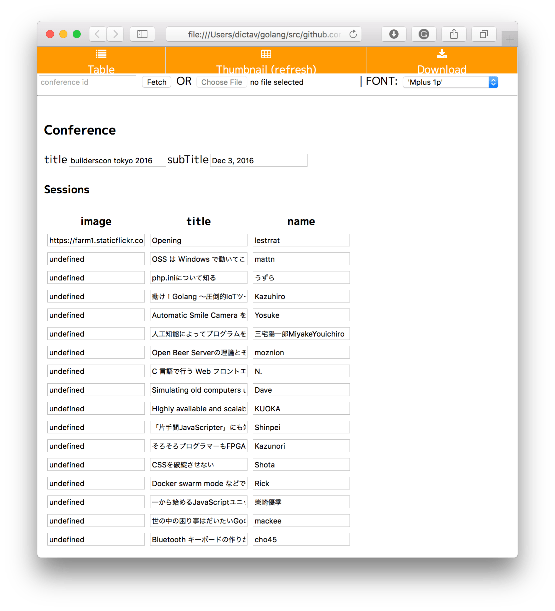

# video-cover-js

[video-cover](https://github.com/builderscon/multimedia-tools/tree/master/video-cover) をJavaScriptで実装してブラウザだけで完結できるように**したい**ものです。

## 使い方

`index.html` をオープンすれば良いので macOS ならば `open` コマンドで起動できます。

```
$ open index.html
```

> Google Chrome の場合は `--allow-file-access-from-files` フラグが必要です
> ```
> open index.html --args --allow-file-access-from-files
> ```



https://builderscon.io/ のカンファレンスIDが分かればデータを取ってくることができます。対象となるのは video_url パラメータを持つ session です。またTSVファイルを読み込めます（予定）。

データを取得するとTableに表示されるので適宜書き換えます。

> - API で取得した場合はイメージ画像がないので全て入力する必要があります。
> - API で取得した場合は name が `first_name` か `nickname` を参照します。
> - title はだいたい長いので、適当なところで `\n` を入れてください。

Thumbnail ボタンを押せば全てのカバー画像を確認できます。
内容がOKであれば Download ボタンを押せば全ての画像を一括ダウンロードできます。

## 依存ライブラリなど

- JSZip (MIT): https://stuk.github.io/jszip/
- FileSaver (MIT): https://github.com/eligrey/FileSaver.js
- Google Fonts + Japanese Early Access: https://googlefonts.github.io/japanese/

## 動作確認

- Chrome 56.0.2924.87 (64-bit)
- Firefox 51.0.1 (64-bit)
- Safari 10.1 (12603.1.29)

## Issues

- License 表記ない
- TSV 読み込めない
- Thumbnail を１度も表示しないで Download すると失敗する(元画像の取得をThumbnailで行なっているため)
- FONTを変えてもカバーが正しいフォントで表示されないことがある
  - Thumbnailをもう一度押すと正しく表示される
  - フォントの読み込む前にキャンバスの描画が走っているのではないか？
- テストない
- コメントない
- Download 押した後の処理に時間がかかるのでインディケーター表示した方が良い
- Thumbnail の表示に時間がかかるのでインディケーター表示した方が良い
- Table 編集時にライブプレビューあった方が良い
- タイトルなどのテキストのポジションやカラーを設定できる方が良い
  - 各カバー毎に変更できるようにするのが良い？？
- マスク（黒いやつ）のカラーなどを調整できるようにしたい
- Table で row の追加と削除をできるようにしたい
- Table の内容を TSV にexportしたい
- テキストの描画をもうちょっとシャキッとさせたい
- gopher.js で書き直したい
- CI したい
