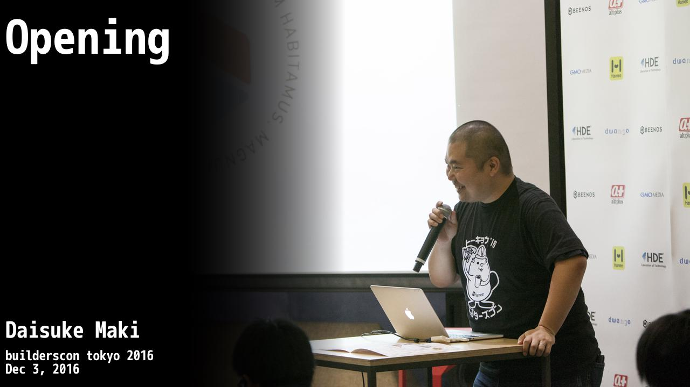

# video-cover

Creates video cover image

# Features

* Automatically insert text on top of image
* Crop/Resizes image to fit 1280x720
* The left half of image is automatically masked to create room for text
* (TODO) Fetch above metadata from builderscon server
* (TODO) Create appengine interface

# Font

* Currently expects migmix-1m-bold.ttf to be present at fonts/ directory.